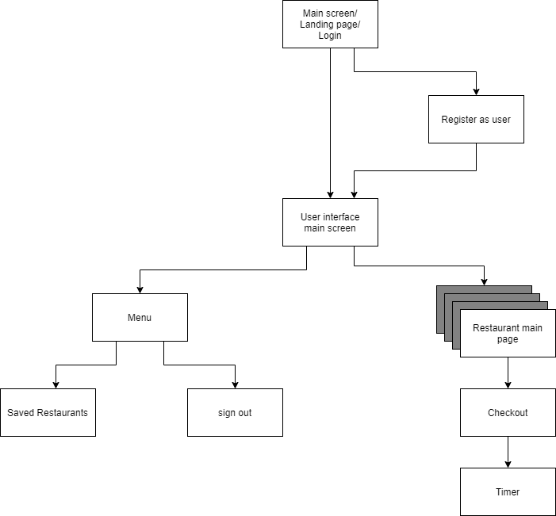
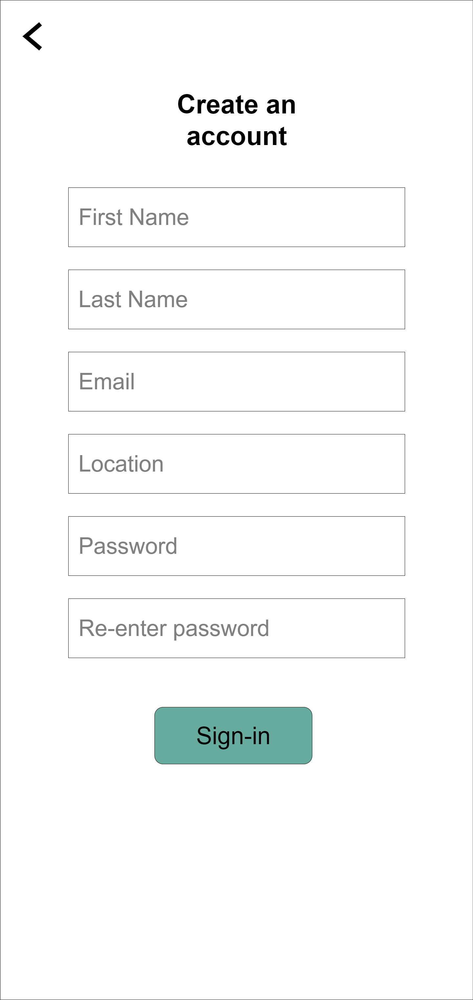
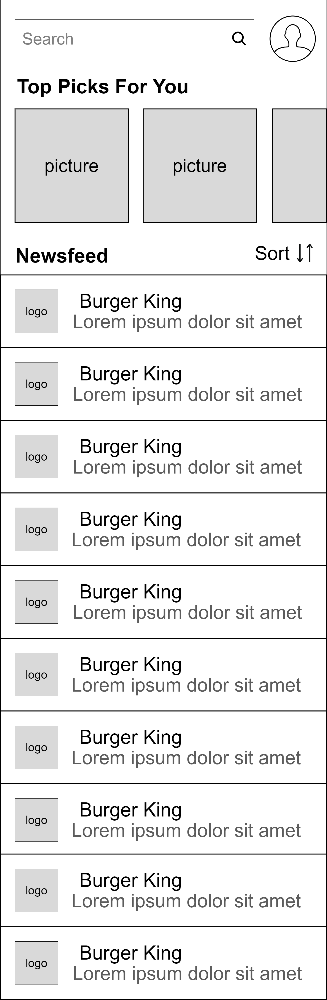
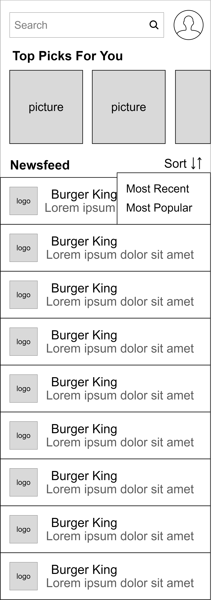
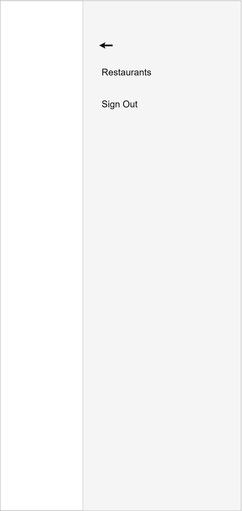
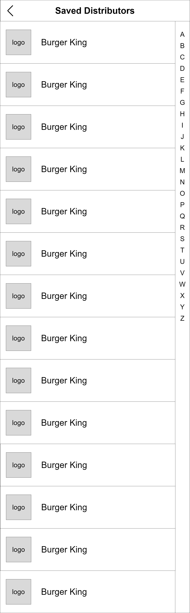
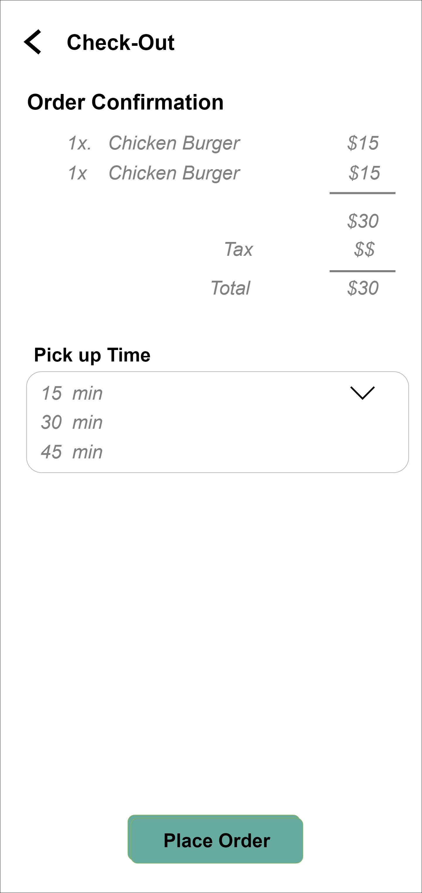

## Prototype

##### Here is a simple demonstration of how we envision *Saverie* to be:
https://saverie.invisionapp.com/console/share/8734W3CTXC/813969771

## App Map
  
 
 

##### The preceding App Map portrays the key parent/child relationships of the different screens of the Application.It depicts the hierarchy of all the screens that we have and also shows as to how they can be accessed.

## Wireframe Diagrams

##### This section gives an overview of the individual wireframes, that we have compiled in a working prototype as well.

### Landing Page
  

This is the first page that will appear when a user opens our application. It provides crucial information regarding the business with a brief background of the company, also displaying our partner restaurants for building user trust and gaining their attention.
It contains two highlighted buttons at the bottom of the screen, where the user can either sign in, or register for the application if they are a first time user.

### Register
  

Since each user will have to register when they first open up our application, they will be prompted to fill in the fields shown in the wireframe and then will be able to sign-in to the application.

### Sign in
  

Once the user has an existing account, they can use the sign-in button on the *Landing Page* to be able to directly log into their account. This will load their data on the application including any favorites, as well as their account information.

### Main Page
  

As the user signs in to the application, this will be the main screen where they will be able to find the most relevant information to them. It lists out all the available restaurants that are serving leftovers right now, alongside highlighting the *top picks* in a carousel of images in the first half of the screen.

### Main Page with sorting
  

The main page with the listings of restaurants also has a functionality of 'sorting' the results with the most recently posted items as well as those that have been the most popular recently.

### Menu
  

On the previous screen, the top right corner had a profile photo of the customer, which slides in an application menu from the right side of the screen. The menu displays two options, one to sign out of the application, and the other to view a list of 'recently saved' restaurants that they have collected from previously.

### Saved Restaurants list
  

Tapping on the 'recently saved' Restaurants' option, an entire list of restaurants that they have previously claimed food from opens up.

### Restaurant Menu Items
  

Going back to our *Main Page*,  it shows our 'Newsfeed' with the available options at the moment, alongside images with the 'top picks'. Clicking on either of those options opens up this page where the items available on restaurant are listed out. It shows a list of options within each category.

### Restaurant Menu Items Descriptions
  

The menu items of the restaurants have a description associated with each that has been listed out. In order to view the description, the user will have to swipe right on the menu item and the above screen will be displayed. On this page, the user can choose the quantity of each item that they would like to have.

### Check Out
  

Once a person has selected the items that they want to obtain, they can click on the Claim Button on the previous screen and will be displayed a checkout screen. On this screen, they will be shown a digital receipt of the items they would like to purchase, and will be prompted with a dropdown to choose a time frame to pick up the food.

### Check Out Select Time

  

When the user clicks on the dropdown to choose the time frame, they will be given the following options of pick up times to choose from and then will revert back again with the updated information to the previous screen.

### Timer Page
  

As the user places an order after choosing the time, they will be displayed a screen with the timer to pick up the food, along with some information that is essential to their retrieval of the leftover food.
